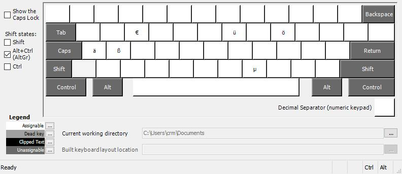
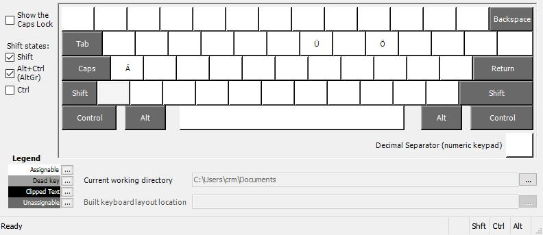

US UMlaut keyboard layout
===========

Maps additonal umlauts to AltGr modifier using Microsoft Keyboard Layout Creator (MSKLC) 






Installation 
===========
1. Compile `usum.klc` with MSKLC 1.4 or use precompiled binaries in releases. 

2. Replace `CAPS` with `AltGR` by adding `scancode_map_caps.reg`

```
Windows Registry Editor Version 5.00

[HKEY_LOCAL_MACHINE\SYSTEM\CurrentControlSet\Control\Keyboard Layout]
"Scancode Map"=hex:00,00,00,00,00,00,00,00,02,00,00,00,38,e0,3a,00,00,00,00,00
```